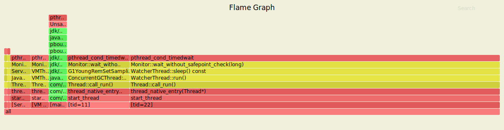
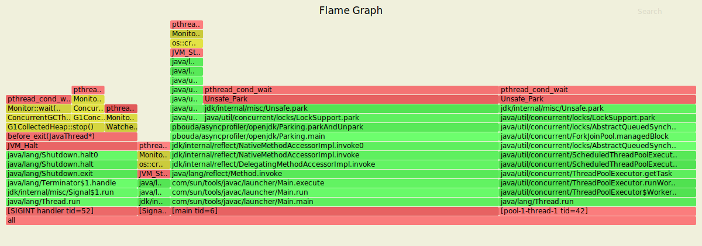
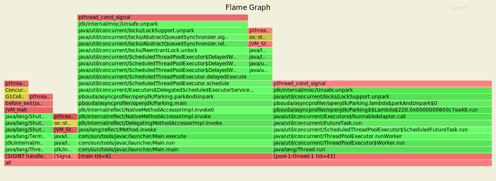

# Flamegraphs regarding Parking/Unparking Threads

### Track LockSupport#parkNanos

```
mkdir -p /tmp/asyncprofiler && cp src/main/java/pbouda/asyncprofiler/openjdk/Parking.java /tmp/asyncprofiler/Parking.java

docker run --rm -it --name parking --security-opt seccomp=unconfined \
-v /tmp/asyncprofiler:/tmp/asyncprofiler openjdk-15-dbg-asyncprofiler:latest java /tmp/asyncprofiler/Parking.java

docker exec -ti parking profiler.sh -t -e pthread_cond_timedwait -f /tmp/asyncprofiler/park_nanos.svg 1
```



### Track LockSupport#park (not only - all threads parking)

```
docker exec -ti parking profiler.sh -t -e pthread_cond_wait -f /tmp/asyncprofiler/park.svg 1
```



### Track LockSupport#unpark (not only - all threads unparking)

```
docker exec -ti parking profiler.sh -t -e pthread_cond_signal -f /tmp/asyncprofiler/unpark.svg 1
```


