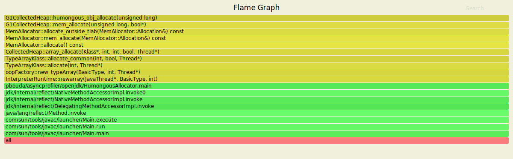

# Async-Profiler tricks with OpenJDK

- C++ Symbols - [Name Mangling](https://en.wikipedia.org/wiki/Name_mangling)
- Docker Image with Debug symbols - https://github.com/petrbouda/openjdk-x-dbg-asyncprofiler
- or Install `openjdk-15-dbg` add a repository `deb http://archive.ubuntu.com/ubuntu groovy main restricted universe multiverse` into `/etc/apt/sources.list.d/official-package-repositories.list` 
- install: `sudo apt get openjdk-15-jdk openjdk-15-dbg openjdk-15-source openjdk-15-doc`
- However, the best option is to build your own OpenJDK (`slowdebug` - no optimizations, no missing methods in Flamegraps), https://github.com/openjdk/jdk

- Simple check: `gdb $JAVA_HOME/lib/server/libjvm.so -ex 'info address UseG1GC'`

### IDE Setup

- [CLion](https://blog.jetbrains.com/clion/2020/03/openjdk-with-clion/)

### External Debug Symbols

- stored externally from an executable file using a build ID 
- https://sourceware.org/gdb/onlinedocs/gdb/Separate-Debug-Files.html

- try this out inside a container - `openjdk-x-dbg-asyncprofiler`
```
$ cd /usr/lib/debug/.build-id
$ grep -r "_ZN15G1CollectedHeap22humongous_obj_allocateEm" .
Binary file ./eb/180e47f20c56d564b6064be501f0f46c7e0ffe.debug matches
$ nm -an ./eb/180e47f20c56d564b6064be501f0f46c7e0ffe.debug | c++filt 
```


- https://www.pingtimeout.fr/posts/2020-02-16-more-humongous-allocations-tracing/

### Linux Setup

- to allow linux perf

```
sudo sh -c 'echo 1 >/proc/sys/kernel/perf_event_paranoid'
sudo sh -c 'echo 0 >/proc/sys/kernel/kptr_restrict'
```

- start the process with the options below if we want to get rid of some problems with inlined frames

```
-XX:+UnlockDiagnosticVMOptions -XX:+DebugNonSafepoints
```

### Humongous Allocation Tracker

```
mkdir -p /tmp/asyncprofiler && cp src/main/java/pbouda/asyncprofiler/openjdk/HumongousAllocator.java /tmp/asyncprofiler/HumongousAllocator.java

# Start the program and wait for profiler and then press enter
docker run --rm -it --name humalloc --security-opt seccomp=unconfined \
-v /tmp/asyncprofiler:/tmp/asyncprofiler openjdk-15-dbg-asyncprofiler:latest java /tmp/asyncprofiler/HumongousAllocator.java

# Attach the profiler
docker exec -ti humalloc profiler.sh -e G1CollectedHeap::humongous_obj_allocate -f /tmp/asyncprofiler/humalloc.svg 1
```



### Heap Dump Tracker

```
mkdir -p /tmp/asyncprofiler && cp src/main/java/pbouda/asyncprofiler/openjdk/HeapDumper.java /tmp/asyncprofiler/HeapDumper.java

# Start the program and wait for profiler
docker run --rm -it --name heapdumper --security-opt seccomp=unconfined \
-v /tmp/asyncprofiler:/tmp/asyncprofiler openjdk-15-dbg-asyncprofiler:latest java /tmp/asyncprofiler/HeapDumper.java

# Attach the profiler
docker exec -ti heapdumper profiler.sh -e HeapDumper::dump -f /tmp/asyncprofiler/heapdumper.svg 1

# Create a heapdump using JCMD console
docker exec -ti heapdumper /usr/lib/jvm/jdk-15+36/bin/jcmd 1 GC.heap_dump filename=/tmp/dump.hprof

# Press enter in the application console
```


### Unsafe Allocation Tracker

```
mkdir -p /tmp/asyncprofiler && cp src/main/java/pbouda/asyncprofiler/openjdk/UnsafeAllocator.java /tmp/asyncprofiler/UnsafeAllocator.java

# Start the program and wait for profiler
docker run --rm -it --name unsafeallocator --security-opt seccomp=unconfined \
-v /tmp/asyncprofiler:/tmp/asyncprofiler openjdk-15-dbg-asyncprofiler:latest java /tmp/asyncprofiler/UnsafeAllocator.java

# Attach the profiler
docker exec -ti unsafeallocator profiler.sh -e Unsafe_AllocateMemory0 -f /tmp/asyncprofiler/unsafeallocator.svg 1

# Press enter in the application console
```


### Explicit GC Tracker

```
mkdir -p /tmp/asyncprofiler && cp src/main/java/pbouda/asyncprofiler/openjdk/ExplicitGC.java /tmp/asyncprofiler/ExplicitGC.java

# Start the program and wait for profiler
docker run --rm -it --name explicitgc --security-opt seccomp=unconfined \
-v /tmp/asyncprofiler:/tmp/asyncprofiler openjdk-15-dbg-asyncprofiler:latest java /tmp/asyncprofiler/ExplicitGC.java

# Attach the profiler
docker exec -ti explicitgc profiler.sh -e JVM_GC -f /tmp/asyncprofiler/explicitgc.svg 1

# Press enter in the application console
```


```
docker exec -ti explicitgc profiler.sh -e SystemGCDCmd::execute -f /tmp/asyncprofiler/explicitgc.svg 1

# Create a heapdump using JCMD console
docker exec -ti explicitgc /usr/lib/jvm/jdk-15+36/bin/jcmd 1 GC.run
```

