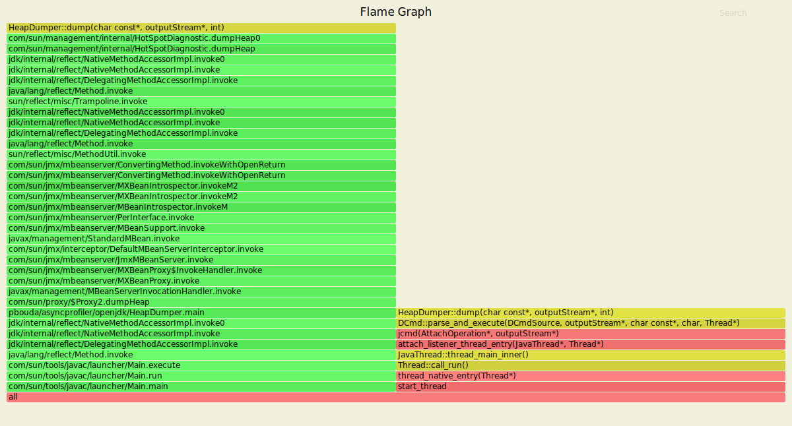

# Async-Profiler tricks with OpenJDK

- `https://github.com/apangin/codeone2019-java-profiling`

- C++ Symbols - [Name Mangling](https://en.wikipedia.org/wiki/Name_mangling)
- Docker Image with Debug symbols - https://github.com/petrbouda/openjdk-x-dbg-asyncprofiler
- or Install `openjdk-15-dbg` add a repository into `/etc/apt/sources.list.d/official-package-repositories.list` 
 - Ubuntu: `deb http://archive.ubuntu.com/ubuntu groovy main restricted universe multiverse`
 - Mint: `deb http://packages.linuxmint.com ulyssa main upstream import backport #id:linuxmint_main`
- install: `sudo apt get openjdk-15-jdk openjdk-15-dbg openjdk-15-source openjdk-15-doc`
- However, the best option is to build your own OpenJDK (`slowdebug` - no optimizations, no missing methods in Flamegraps), https://github.com/openjdk/jdk

- Simple check: `gdb $JAVA_HOME/lib/server/libjvm.so -ex 'info address UseG1GC'`

### IDE Setup

- [CLion](https://blog.jetbrains.com/clion/2020/03/openjdk-with-clion/)

### External Debug Symbols

- stored externally from an executable file using a build ID 
- https://sourceware.org/gdb/onlinedocs/gdb/Separate-Debug-Files.html

- try this out inside a container - `openjdk-x-dbg-asyncprofiler`
```
$ cd /usr/lib/debug/.build-id
$ grep -r "_ZN15G1CollectedHeap22humongous_obj_allocateEm" .
Binary file ./eb/180e47f20c56d564b6064be501f0f46c7e0ffe.debug matches
$ nm -an ./eb/180e47f20c56d564b6064be501f0f46c7e0ffe.debug | c++filt 
```


- https://www.pingtimeout.fr/posts/2020-02-16-more-humongous-allocations-tracing/

### Linux Setup

- to allow linux perf

```
sudo sh -c 'echo 1 >/proc/sys/kernel/perf_event_paranoid'
sudo sh -c 'echo 0 >/proc/sys/kernel/kptr_restrict'
```

```
==============================================================
perf_event_paranoid:

Controls use of the performance events system by unprivileged
users (without CAP_SYS_ADMIN).  The default value is 2.

 -1: Allow use of (almost) all events by all users
     Ignore mlock limit after perf_event_mlock_kb without CAP_IPC_LOCK
>=0: Disallow ftrace function tracepoint by users without CAP_SYS_ADMIN
     Disallow raw tracepoint access by users without CAP_SYS_ADMIN
>=1: Disallow CPU event access by users without CAP_SYS_ADMIN
>=2: Disallow kernel profiling by users without CAP_SYS_ADMIN
==============================================================

==============================================================
kptr_restrict:

This toggle indicates whether restrictions are placed on
exposing kernel addresses via /proc and other interfaces.

When kptr_restrict is set to 0 (the default) the address is hashed before
printing. (This is the equivalent to %p.)

When kptr_restrict is set to (1), kernel pointers printed using the %pK
format specifier will be replaced with 0's unless the user has CAP_SYSLOG
and effective user and group ids are equal to the real ids. This is
because %pK checks are done at read() time rather than open() time, so
if permissions are elevated between the open() and the read() (e.g via
a setuid binary) then %pK will not leak kernel pointers to unprivileged
users. Note, this is a temporary solution only. The correct long-term
solution is to do the permission checks at open() time. Consider removing
world read permissions from files that use %pK, and using dmesg_restrict
to protect against uses of %pK in dmesg(8) if leaking kernel pointer
values to unprivileged users is a concern.

When kptr_restrict is set to (2), kernel pointers printed using
%pK will be replaced with 0's regardless of privileges.
==============================================================
```

- a permanent solution (settings before will disappear after a restart)
- create file `/etc/sysctl.d/99-async-profiler.conf` with the content

```
kernel.perf_event_paranoid=-1
kernel.kptr_restrict=0
```

- If changing the configuration is not possible, you may fall back to `-e itimer` profiling mode. 
It is similar to cpu mode, but does not require perf_events support. 
As a drawback, there will be no kernel stack traces.

- start the process with the options below if we want to get rid of some problems with inlined frames

```
-XX:+UnlockDiagnosticVMOptions -XX:+DebugNonSafepoints


When agent is not loaded at JVM startup (by using -agentpath option) it is highly recommended 
to use -XX:+UnlockDiagnosticVMOptions -XX:+DebugNonSafepoints JVM flags. Without those flags 
the profiler will still work correctly but results might be less accurate e.g. 
without -XX:+DebugNonSafepoints there is a high chance that simple inlined methods 
will not appear in the profile. When agent is attached at runtime 
CompiledMethodLoad JVMTI event enables debug info, but only for methods compiled 
after the event is turned on.
```

### Humongous Allocation Tracker

```
mkdir -p /tmp/asyncprofiler && cp src/main/java/pbouda/asyncprofiler/openjdk/HumongousAllocator.java /tmp/asyncprofiler/HumongousAllocator.java

# Start the program and wait for profiler and then press enter
docker run --rm -it --name humalloc --security-opt seccomp=unconfined \
-v /tmp/asyncprofiler:/tmp/asyncprofiler openjdk-15-dbg-asyncprofiler:latest java /tmp/asyncprofiler/HumongousAllocator.java

# Attach the profiler
docker exec -ti humalloc profiler.sh -e G1CollectedHeap::humongous_obj_allocate -f /tmp/asyncprofiler/humalloc.svg 1
```


### Heap Dump Tracker

```
mkdir -p /tmp/asyncprofiler && cp src/main/java/pbouda/asyncprofiler/openjdk/HeapDumper.java /tmp/asyncprofiler/HeapDumper.java

# Start the program and wait for profiler
docker run --rm -it --name heapdumper --security-opt seccomp=unconfined \
-v /tmp/asyncprofiler:/tmp/asyncprofiler openjdk-15-dbg-asyncprofiler:latest java /tmp/asyncprofiler/HeapDumper.java

# Attach the profiler
docker exec -ti heapdumper profiler.sh -e HeapDumper::dump -f /tmp/asyncprofiler/heapdumper.svg 1

# Create a heapdump using JCMD console
docker exec -ti heapdumper /usr/lib/jvm/jdk-15+36/bin/jcmd 1 GC.heap_dump filename=/tmp/dump.hprof

# Press enter in the application console
```



### Unsafe Allocation Tracker

```
mkdir -p /tmp/asyncprofiler && cp src/main/java/pbouda/asyncprofiler/openjdk/UnsafeAllocator.java /tmp/asyncprofiler/UnsafeAllocator.java

# Start the program and wait for profiler
docker run --rm -it --name unsafeallocator --security-opt seccomp=unconfined \
-v /tmp/asyncprofiler:/tmp/asyncprofiler openjdk-15-dbg-asyncprofiler:latest java /tmp/asyncprofiler/UnsafeAllocator.java

# Attach the profiler
docker exec -ti unsafeallocator profiler.sh -e Unsafe_AllocateMemory0 -f /tmp/asyncprofiler/unsafeallocator.svg 1

# Press enter in the application console
```


### Explicit GC Tracker

```
mkdir -p /tmp/asyncprofiler && cp src/main/java/pbouda/asyncprofiler/openjdk/ExplicitGC.java /tmp/asyncprofiler/ExplicitGC.java

# Start the program and wait for profiler
docker run --rm -it --name explicitgc --security-opt seccomp=unconfined \
-v /tmp/asyncprofiler:/tmp/asyncprofiler openjdk-15-dbg-asyncprofiler:latest java /tmp/asyncprofiler/ExplicitGC.java

# Attach the profiler
docker exec -ti explicitgc profiler.sh -e JVM_GC -f /tmp/asyncprofiler/explicitgc.svg 1

# Press enter in the application console
```


```
docker exec -ti explicitgc profiler.sh -e SystemGCDCmd::execute -f /tmp/asyncprofiler/explicitgc.svg 1

# Create a heapdump using JCMD console
docker exec -ti explicitgc /usr/lib/jvm/jdk-15+36/bin/jcmd 1 GC.run
```


