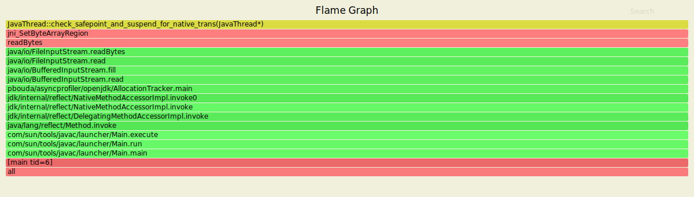
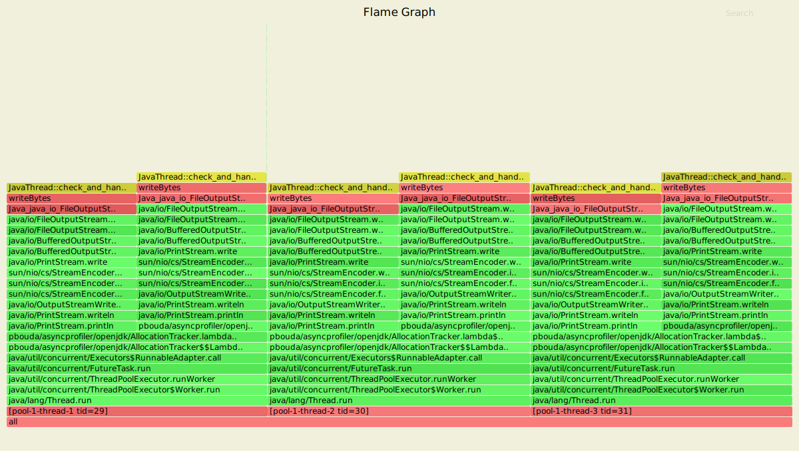

# Flamegraphs regarding Safepoints


### Safepoint in Native Code

```
mkdir -p /tmp/asyncprofiler && cp src/main/java/pbouda/asyncprofiler/openjdk/AllocationTracker.java /tmp/asyncprofiler/AllocationTracker.java

docker run --rm -it --name safepoint --security-opt seccomp=unconfined \
-v /tmp/asyncprofiler:/tmp/asyncprofiler openjdk-15-dbg-asyncprofiler:latest java -Xmx256m -Xms50m -XX:+UseSerialGC /tmp/asyncprofiler/AllocationTracker.java

docker exec -ti safepoint profiler.sh -t -e JavaThread::check_safepoint_and_suspend_for_native_trans -f /tmp/asyncprofiler/serial_allocation.svg 1
```



