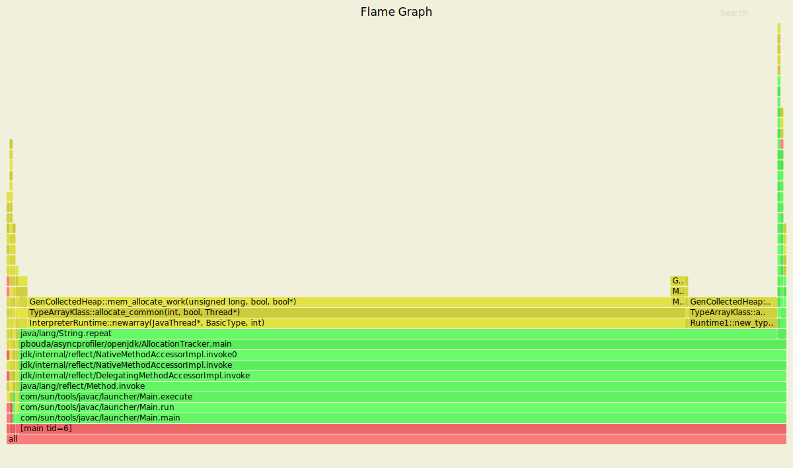
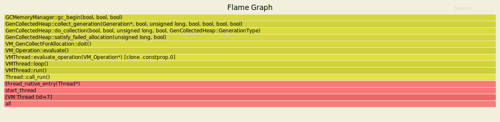
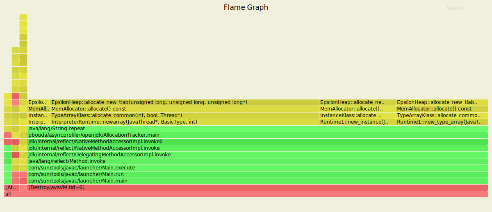
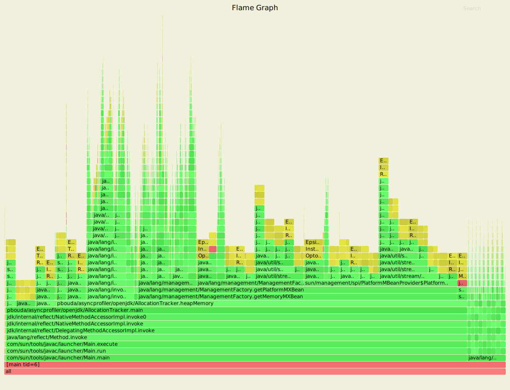

# Flamegraphs regarding SerialGC


### Track the allocation path

```
mkdir -p /tmp/asyncprofiler && cp src/main/java/pbouda/asyncprofiler/openjdk/AllocationTracker.java /tmp/asyncprofiler/AllocationTracker.java

docker run --rm -it --name serial --security-opt seccomp=unconfined \
-v /tmp/asyncprofiler:/tmp/asyncprofiler openjdk-15-dbg-asyncprofiler:latest java -Xmx256m -Xms50m -XX:+UseSerialGC /tmp/asyncprofiler/AllocationTracker.java

docker exec -ti serial profiler.sh -t -e GenCollectedHeap::mem_allocate_work -f /tmp/asyncprofiler/serial_allocation.svg 1
```



### GC Begin

```
docker exec -ti serial profiler.sh -t -e GCMemoryManager::gc_begin -f /tmp/asyncprofiler/serial_gc_begin.svg 1
```



### New TLAB Allocation

```
// ... same as before

docker exec -ti epsilon profiler.sh -t -e EpsilonHeap::allocate_new_tlab -f /tmp/asyncprofiler/epsilon_new_tlab.svg 1
```



### Allocation Without TLAB
- add `-XX:-UseTLAB`

```
docker run --rm -it --name epsilon --security-opt seccomp=unconfined \
-v /tmp/asyncprofiler:/tmp/asyncprofiler openjdk-15-dbg-asyncprofiler:latest java -Xmx256m -Xms50m -XX:-UseTLAB -XX:+UnlockExperimentalVMOptions -XX:+UseEpsilonGC /tmp/asyncprofiler/AllocationTracker.java

docker exec -ti epsilon profiler.sh -t -e EpsilonHeap::allocate_work -f /tmp/asyncprofiler/epsilon_without_tlab.svg 1
```

