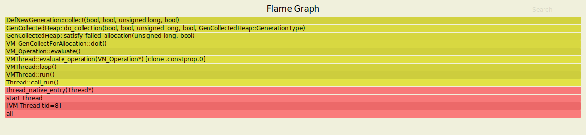

# Flamegraphs regarding SerialGC


### Track the allocation path

```
mkdir -p /tmp/asyncprofiler && cp src/main/java/pbouda/asyncprofiler/openjdk/AllocationTracker.java /tmp/asyncprofiler/AllocationTracker.java

docker run --rm -it --name serial --security-opt seccomp=unconfined \
-v /tmp/asyncprofiler:/tmp/asyncprofiler openjdk-15-dbg-asyncprofiler:latest java -Xmx256m -Xms50m -XX:+UseSerialGC /tmp/asyncprofiler/AllocationTracker.java

docker exec -ti serial profiler.sh -t -e GenCollectedHeap::mem_allocate_work -f /tmp/asyncprofiler/serial_allocation.svg 1
```


### GC Begin

```
docker exec -ti serial profiler.sh -t -e GCMemoryManager::gc_begin -f /tmp/asyncprofiler/serial_gc_begin.svg 1
```


### GC Collect

```
docker exec -ti epsilon profiler.sh -t -e DefNewGeneration::collect -f /tmp/asyncprofiler/serial-collect.svg 1
```


